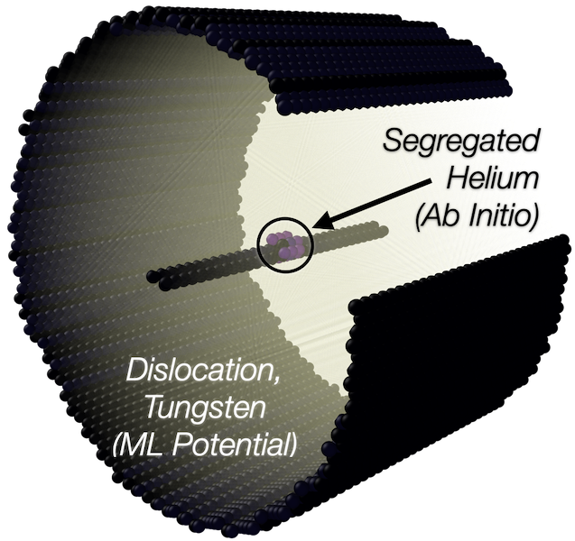

<h1 align=center>Hybrid <i>ab initio</i>-machine learning simulations of dislocations</h1>

<table align="center" style="border:0px solid white;"> 
  <tr style="border:0px;">
    <td width="700" style="border:0px;">
      <p>
      <code>LML_retrain</code> is an advanced coupling scheme to embed small DFT simulations in large-scale MD.
      To enable this embedding, we retrain (make small parameter adjustments to) <i>linear</i> machine learning potentials,
      giving seamless coupling between DFT and MD, to significantly extend the scope of hybrid simulation methods.</p>
      <p align=center>
    
      <br>
      <i> He segregration to screw dislocation in W</i>
        </p>
      The method is described in detail in a recent publication:
<i>Calculation of dislocation binding to helium-vacancy defects in tungsten using hybrid ab initio-machine learning methods</i>
      <p> Acta Materialia, 2023: https://doi.org/10.1016/j.actamat.2023.118734</p>
      <p> ArXiv preprint: https://arxiv.org/abs/2111.11262</p>
      <p>Project funded by ANR JCJC MeMoPas: https://anr.fr/Project-ANR-19-CE46-0006</p>
      <p>Team: Petr Grigorev (https://pgrigorev.github.io) and TD Swinburne (PI, https://tomswinburne.github.io), CNRS and CINaM Marseille</p>

# Requirements

Python packages can be easily installed via `pip` or other package managers; see e.g. [anaconda](https://www.anaconda.com)

- Running retraining scripts requires [numpy](https://numpy.org/) and [scipy](https://docs.scipy.org/doc/scipy/reference/generated/scipy.linalg.orth.html) 

- Evaluating atomic structures and generating descriptor vectors requires [Atomic Simulation Environment](https://wiki.fysik.dtu.dk/ase/) on top of the `LAMMPS` [python module](https://docs.lammps.org/Python_module.html). 

- `LAMMPS` should be compiled with [`ML-SNAP` package](https://docs.lammps.org/pair_snap.html#restrictions) which is not included by default, i.e. with a traditional make for `LAMMPS`
```
  cd /path/to/lammps/src
  make yes-ML-SNAP
  make yes-[OTHER PACKAGES]
  make mpi mode=shlib
```

- Script for calculating dislocation glide barriers depends on [matscipy](https://github.com/libAtoms/matscipy) dislocation module. 
    </td>
  </tr>
  </table>


